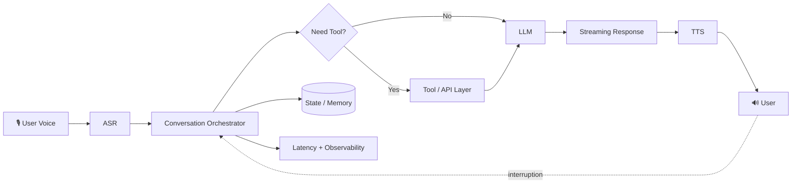

<div align="center">

# HEY, I'M HEMNATH 👋

### AI Engineer • Voice AI • LLM Systems • Real-Time Engineering

**I build systems that listen, reason, act, and speak — in real time.**

<br/>

<a href="https://github.com/Hemnath4114">
  
</a>
<a href="https://github.com/Hemnath4114">
  
</a>
<a href="mailto:hemnath041104@gmail.com">
  
</a>
<a href="https://www.linkedin.com/in/hemnath-marimuthu-in/">
  
</a>

<br/><br/>


</div>

---

## `whoami`

```text
Hemnath M

AI Engineer
├── Voice AI
├── Conversational AI
├── LLM Systems
├── Real-Time Streaming
├── AI Infrastructure
├── Latency Engineering
└── Full-Stack Foundations

Currently fascinated by:
How do we make intelligent systems feel immediate?
```

I'm a developer who moved beyond simply building applications and became increasingly interested in **how intelligent systems behave under real-world constraints**.

My current work sits at the intersection of:

**AI × Voice × Distributed Systems × Software Engineering**

I work with systems involving speech recognition, LLM reasoning, tool execution, streaming pipelines, text-to-speech, orchestration, and latency optimization.

The interesting part isn't making every component work independently.

The interesting part is making the **entire system work together fast enough that a human stops noticing the machinery behind it.**

---

## `current_mode.exe`

```text
MODE:              BUILDING

PRIMARY DOMAIN:    AI ENGINEERING
SPECIALIZATION:   VOICE + CONVERSATIONAL SYSTEMS

CURRENT QUESTIONS:

→ How do we reduce end-to-end conversational latency?
→ How should streaming pipelines be orchestrated?
→ Where should state live?
→ When should an LLM call a tool?
→ How do we prevent unnecessary LLM round trips?
→ How do we stream intelligence instead of waiting for it?
→ How do we make voice agents interruptible?
→ How do we measure perceived latency, not just API latency?

STATUS:

███████████████████████░░░  Always learning
```

---

# 🧠 What I Build

I am particularly interested in **production AI systems**, not only models.

### Voice AI

```text
User Speech
    ↓
Speech Detection
    ↓
ASR / Transcription
    ↓
Language / Intent Routing
    ↓
LLM Orchestration
    ↓
Tool / API Execution
    ↓
Response Generation
    ↓
Streaming TTS
    ↓
User
```

The real engineering challenge is everything that happens **between those arrows**.

Streaming.
Queues.
Backpressure.
Barge-in.
Cancellation.
Latency.
State.
Retries.
Concurrency.
Tool orchestration.
Partial outputs.
Failure handling.

That is where I like working.

---

# ⚡ My Engineering Obsession

## Latency

A conversational AI system can be functionally correct and still feel broken.

I care about the difference between:

```text
"It eventually answered."
```

and

```text
"It felt instantaneous."
```

So I think in terms of the entire critical path:

```text
User stops speaking
        ↓
VAD / endpoint detection
        ↓
ASR latency
        ↓
LLM first-token latency
        ↓
Tool latency
        ↓
LLM continuation latency
        ↓
TTS first-audio latency
        ↓
Audio playback
```

And I ask:

> **Which milliseconds are actually necessary?**

That question drives a lot of my engineering decisions.

---

# 🏗️ The Kind of Systems I Like



I am especially interested in architectures where the system behaves like a **pipeline**, rather than a sequence of blocking API calls.

---

# 🔬 Areas I'm Deep In

| Domain                | What interests me                                        |
| --------------------- | -------------------------------------------------------- |
| 🎙️ Voice AI          | STT, TTS, VAD, turn-taking, barge-in                     |
| 🧠 LLM Systems        | prompting, routing, tool calling, structured outputs     |
| ⚡ Latency Engineering | TTFT, TTFA, queueing, parallelization                    |
| 🔄 Streaming          | token streaming, audio streaming, incremental processing |
| 🧩 Orchestration      | DAGs, state machines, async workflows                    |
| 🛠️ Tool Calling      | API execution, retries, validation, cancellation         |
| 🧠 Memory             | conversation state, context management, persistence      |
| 📊 Observability      | tracing, timing analysis, bottleneck detection           |
| 🏎️ Performance       | concurrency, batching, connection reuse                  |
| 🏗️ Backend Systems   | APIs, services, async Python, distributed workflows      |
| 💻 Full Stack         | frontend + backend fundamentals when the system needs it |

---

# 🧰 Technology

### AI / ML

<p align="center">


</p>

`LLMs` · `Speech-to-Text` · `Text-to-Speech` · `Voice AI` · `Embeddings` · `Inference` · `Model Evaluation`

---

### Backend / Systems

<p align="center">


</p>

`AsyncIO` · `REST APIs` · `WebSockets` · `Streaming` · `Queues` · `Concurrency` · `Microservices`

---

### Frontend

<p align="center">


</p>

I came from the full-stack side of engineering, so I still care about the interface.

The difference now is that I'm more interested in what happens **behind the interface**.

---

### Data / Infrastructure

<p align="center">


</p>

`State` · `Caching` · `Persistence` · `Containers` · `Version Control`

---

# 🧪 Current Technical Interests

```yaml
AI:
  - LLM orchestration
  - conversational agents
  - speech systems
  - inference pipelines
  - model evaluation

VOICE:
  - streaming ASR
  - streaming TTS
  - interruption handling
  - turn detection
  - conversational timing

SYSTEMS:
  - async architectures
  - DAG execution
  - event-driven workflows
  - tool orchestration
  - queue design
  - state management

PERFORMANCE:
  - end-to-end latency
  - first-token latency
  - first-audio latency
  - parallel execution
  - connection reuse
  - critical-path optimization

ENGINEERING:
  - observability
  - debugging
  - reliability
  - production readiness
  - failure isolation
```

---

# 🧩 How I Think About AI Systems

A model is not a product.

A model is a **component**.

A production AI system also needs:

```text
                 ┌──────────────────────┐
                 │      AI MODEL        │
                 └──────────┬───────────┘
                            │
        ┌───────────────────┼───────────────────┐
        │                   │                   │
        ▼                   ▼                   ▼
   Orchestration         Memory            Tooling
        │                   │                   │
        └───────────────────┼───────────────────┘
                            │
                            ▼
                     Streaming Layer
                            │
                            ▼
                     Observability
                            │
                            ▼
                     Reliability
```

The model may provide intelligence.

**The architecture determines whether that intelligence is actually useful.**

---

# 🚀 Things I've Built / Worked On

### 🎙️ Real-Time Voice Agent Systems

Architectures involving:

* speech recognition
* LLM reasoning
* tool execution
* state management
* streamed model output
* streamed TTS
* interruption handling
* latency optimization

### ⚡ Voice Latency Optimization

Worked on reducing unnecessary waiting inside conversational pipelines by analyzing:

```text
LLM
 ↓
Tool Call
 ↓
LLM
 ↓
TTS
```

and looking for opportunities around:

```text
parallelism
streaming
early execution
queue optimization
state reuse
cancellation
critical-path reduction
```

### 🧠 AI Engineering Experiments

Exploring how different:

* LLMs
* speech models
* TTS systems
* orchestration strategies
* routing methods
* prompting approaches

behave under actual system constraints.

---

# 📐 Engineering Philosophy

### 01 — Measure before optimizing

```text
intuition
   ↓
hypothesis
   ↓
measurement
   ↓
bottleneck
   ↓
optimization
   ↓
measurement again
```

### 02 — Optimize the critical path

Making a non-critical component faster does not matter if the user still waits on the critical path.

### 03 — Stream whenever possible

Don't wait for:

```text
everything → complete → process → respond
```

Prefer:

```text
partial → process → emit → continue
```

### 04 — Minimize unnecessary work

Every extra:

* network request
* serialization step
* model round trip
* queue hop
* blocking call

is a potential source of latency.

### 05 — Build for failure

Real systems fail.

Networks fail.
Models fail.
Tools timeout.
Connections disappear.
Audio arrives late.
Users interrupt.

Good systems expect that.

---

# 🧠 My Current Mental Model

```text
                 HUMAN
                   │
                   ▼
               ┌───────┐
               │ VOICE │
               └───┬───┘
                   │
                   ▼
          ┌────────────────┐
          │ PERCEPTION     │
          │ ASR / VAD / LID│
          └───────┬────────┘
                  │
                  ▼
          ┌────────────────┐
          │ ORCHESTRATION  │
          │ State + Policy │
          └───────┬────────┘
                  │
          ┌───────┼────────┐
          │       │        │
          ▼       ▼        ▼
        LLM     TOOLS    MEMORY
          │       │        │
          └───────┼────────┘
                  │
                  ▼
          ┌────────────────┐
          │ GENERATION     │
          │ Streaming LLM  │
          └───────┬────────┘
                  │
                  ▼
          ┌────────────────┐
          │ SPEECH         │
          │ Streaming TTS  │
          └───────┬────────┘
                  │
                  ▼
                HUMAN
```

The goal is not simply to connect these boxes.

The goal is to make the **whole loop disappear**.

---

# 🛠️ Tools I Reach For

<p align="center">


</p>

I also spend a lot of time with the less glamorous but more important tools:

```text
logs
profilers
traces
timers
benchmarks
network inspection
model evaluation
load tests
failure reproduction
```

Because when something feels slow, "probably the model" is not an analysis.

---

# 📊 GitHub Activity

<p align="center">


</p>

<p align="center">


</p>

---

# 📈 Contribution Graph

<p align="center">


</p>

---

# 🏆 Achievements

```text
◆ Built and worked on production-oriented AI systems
◆ Explored real-time voice interaction architectures
◆ Worked deeply with LLM tool-calling workflows
◆ Focused on reducing conversational system latency
◆ Built full-stack applications before moving deeper into AI engineering
◆ Continued experimenting with speech, LLM, and orchestration systems
◆ Always learning something that makes the previous version obsolete
```

---

# 🌌 Beyond the Code

I like systems that are:

```text
simple
        ↓
fast
        ↓
predictable
        ↓
beautiful
        ↓
hard to break
```

I enjoy:

**AI · voice technology · system design · problem solving · music · football · cricket · late-night debugging**

And yes —

I still care way too much about good UI.

Because engineering should work beautifully **inside and outside**.

---

# 🛰️ What I'm Exploring Next

```text
        ┌─────────────────────────────┐
        │     NEXT FRONTIER           │
        └──────────────┬──────────────┘
                       │
         ┌─────────────┼─────────────┐
         ▼             ▼             ▼
    Voice Agents    AI Systems    Inference
         │             │             │
         └─────────────┼─────────────┘
                       │
                       ▼
                Real-Time AI
                       │
                       ▼
                 Human-Like
                  Interaction
```

The long-term goal is simple:

> **Build AI systems that don't feel like software talking to a human.**

They should feel like another participant in the conversation.

---

# 🔗 Find Me

<p align="center">

<a href="mailto:hemnath041104@gmail.com">
  
</a>

<a href="https://www.linkedin.com/in/hemnath-marimuthu-in/">
  
</a>

<a href="https://github.com/Hemnath4114">
  
</a>

<a href="https://www.instagram.com/hemnath._._/">
  
</a>

</p>

---

<div align="center">

### `SIGNAL > NOISE`

**Build things worth understanding.**

**Measure what matters.**

**Make the machine disappear.**

<br/>

`Made with curiosity, stubbornness, and a ridiculous amount of debugging.`

<br/>

**— Hemnath M 🚀**

</div>
