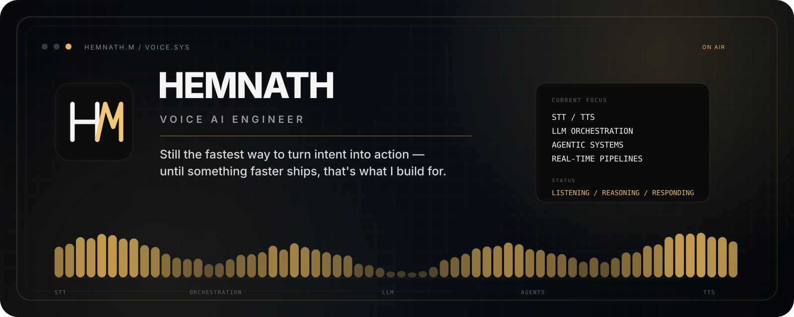
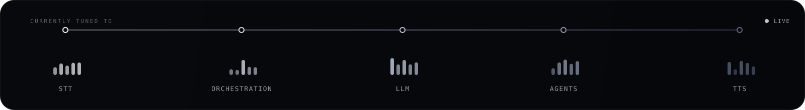
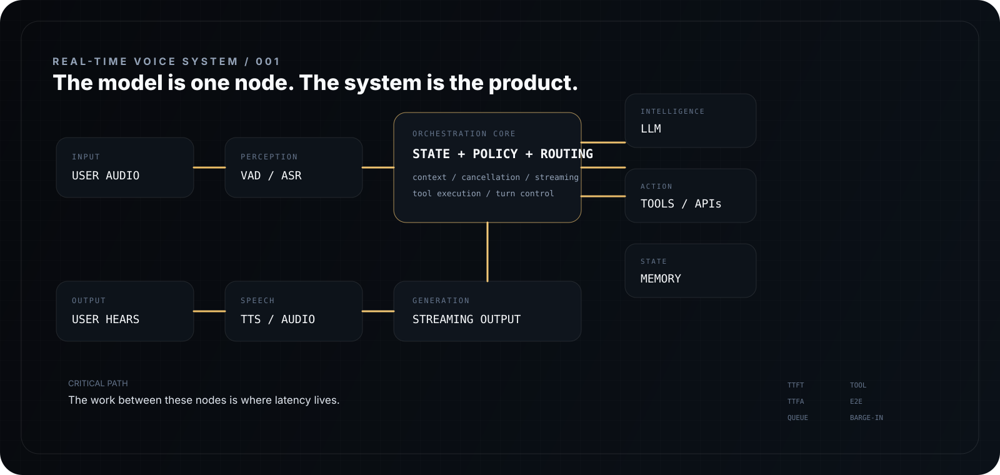
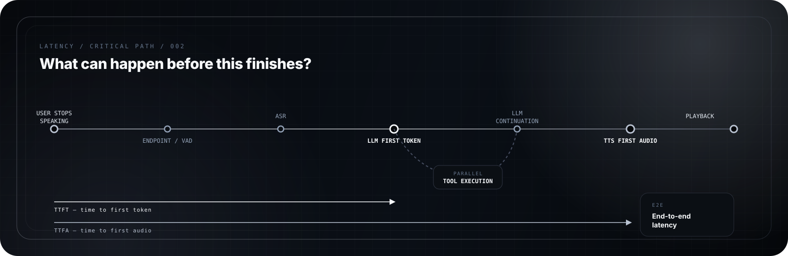

 

  

### `I BUILD THE SYSTEMS THAT LET AI LISTEN, THINK, AND SPEAK BACK — IN TIME.`

---

<table>
<tr>
<td align="center" width="25%">

**SPEECH**

STT · TTS
Turn-taking
Barge-in

</td>
<td align="center" width="25%">

**REASONING**

LLM Orchestration
Context
Routing

</td>
<td align="center" width="25%">

**ACTION**

Agentic Systems
Tool Calling
Async Execution

</td>
<td align="center" width="25%">

**PERFORMANCE**

Latency
Streaming
Critical Paths

</td>
</tr>
</table>

---

## About

I'm **Hemnath M** — an engineer working at the intersection of speech and language systems: turning audio into intent, intent into action, and action back into natural speech, without making anyone wait for it.

**speech-to-text · text-to-speech · LLM orchestration · agentic workflows · real-time streaming · latency engineering**

I like the part most people don't design for:

> the turn-taking, interruptions, retries and milliseconds that decide whether a voice system feels alive — or just laggy.

---

## Currently

The challenge is never connecting the boxes.

**It's removing the waiting between them.**

---

## Why Voice

New interfaces keep shipping — gaze tracking, gesture, silent text-to-everything. Almost all of them still need a voice to wake up.

Voice compresses intent into something a system can act on faster than nearly any other input we've built. It's not the flashiest interface — it's just the one that already works, everywhere, for everyone.

**Until something like a direct thought-interface exists, that's reason enough to take it seriously.**

---

## Architecture

*The shape of the systems I build — perception, orchestration, action, and generation, wired for real time.*

---

## Principles

<table>
<tr>
<td width="50%" valign="top">

### 01 — STREAM THE WORK

Don't make the user wait for a complete result when a useful partial result can already move forward.

</td>
<td width="50%" valign="top">

### 02 — ATTACK THE CRITICAL PATH

The slowest visible dependency wins. Optimize there first.

</td>
</tr>
<tr>
<td width="50%" valign="top">

### 03 — MEASURE THE SYSTEM

`TTFT` · `TTFA` · `E2E` · queue delay · tool latency · throughput

</td>
<td width="50%" valign="top">

### 04 — DESIGN FOR INTERRUPTION

Users change their minds mid-sentence. Networks fail. Tools time out. Good systems recover without breaking the illusion.

</td>
</tr>
</table>

---

## Performance

Conversational quality isn't decided by the model API. It's decided by everything **around** it — and the question that drives the design:

`parallelism` · `early execution` · `streaming` · `connection reuse` · `state reuse` · `cancellation`

---

## Stack

### Speech & AI

  

`LLMs` · `STT` · `TTS` · `VAD` · `Embeddings` · `Inference` · `Evaluation`

  

### Systems

  

`AsyncIO` · `WebSockets` · `Streaming` · `Queues` · `Concurrency` · `APIs`

  

### Product Layer

---

## Earlier Work

Before voice, there was full-stack — the earlier chapters that built the engineering base this domain focus stands on.

### `THINKNOTES` — Collaborative Knowledge System

**MERN · collaboration · backend logic · UI/UX**

### `MOODTUNES` — Mood-Based Music Experience

**JavaScript · interaction · personalization**

---

## GitHub

  

---

---

### HEMNATH M

`VOICE AI ENGINEER` · `SPEECH SYSTEMS` · `REAL-TIME AI`

 

[GitHub](https://github.com/Hemnath4114) · [LinkedIn](https://www.linkedin.com/in/hemnath-marimuthu-in/) · [Email](mailto:hemnath041104@gmail.com)

  

Built with sound in mind.

