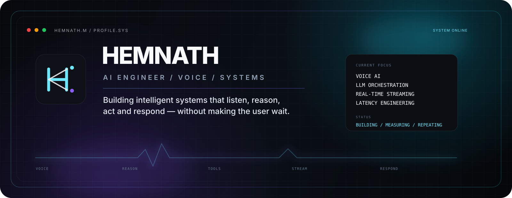
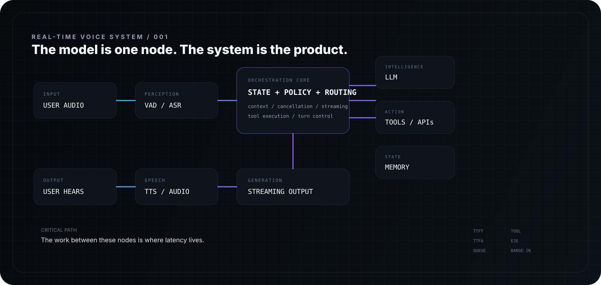

<div align="center">



<br/>

<a href="https://github.com/Hemnath4114">
  
</a>
<a href="https://www.linkedin.com/in/hemnath-marimuthu-in/">
  
</a>
<a href="mailto:hemnath041104@gmail.com">
  
</a>

<br/><br/>

### `I BUILD THE LAYER BETWEEN INTELLIGENCE AND EXPERIENCE.`

</div>

---

<div align="center">

<table>
<tr>
<td align="center" width="25%">

**AI ENGINEERING**

LLMs  
Agents  
Evaluation

</td>
<td align="center" width="25%">

**VOICE AI**

ASR  
TTS  
Turn-taking

</td>
<td align="center" width="25%">

**REAL-TIME**

Streaming  
Async  
WebSockets

</td>
<td align="center" width="25%">

**PERFORMANCE**

Latency  
Queues  
Critical paths

</td>
</tr>
</table>

</div>

---

## `/profile`

I’m **Hemnath M** — an engineer moving deeper from full-stack development into **AI systems engineering**.

My focus is the machinery around intelligent products:

**voice pipelines · LLM orchestration · tool calling · streaming · memory · async execution · latency engineering · production reliability**

I like the part most people don't see:

> the milliseconds, queues, state transitions, retries, cancellations and decisions that make an AI system feel effortless.

---

## `/now`


```text
voice
  ↓
perception
  ↓
reasoning
  ↓
action
  ↓
generation
  ↓
speech
```

The challenge is not connecting the boxes.

**The challenge is removing the waiting between them.**

---

## `/architecture`

<div align="center">

</div>

---

## `/principles`

<table>
<tr>
<td width="50%" valign="top">

### 01 — STREAM THE WORK

Don't make the user wait for a complete result when a useful partial result can already move forward.

</td>
<td width="50%" valign="top">

### 02 — ATTACK THE CRITICAL PATH

The slowest visible dependency wins. Optimize there first.

</td>
</tr>
<tr>
<td width="50%" valign="top">

### 03 — MEASURE THE SYSTEM

`TTFT` · `TTFA` · `E2E` · queue delay · tool latency · throughput

</td>
<td width="50%" valign="top">

### 04 — DESIGN FOR INTERRUPTION

Users change their minds. Networks fail. Tools time out. Good systems recover.

</td>
</tr>
</table>

---

## `/stack`

<div align="center">

### AI / ML


<br/><br/>

`LLMs` · `Speech AI` · `ASR` · `TTS` · `Embeddings` · `Inference`

<br/><br/>

### Systems


<br/><br/>

`AsyncIO` · `WebSockets` · `Streaming` · `Queues` · `Concurrency` · `APIs`

<br/><br/>

### Product Layer


</div>

---

## `/selected-work`

### `LOLA` — Real-Time Conversational AI

Voice systems where **ASR → LLM → tools → TTS** have to behave like one continuous experience.

**Interests:** streaming, orchestration, state, interruption, latency, model evaluation.

---

### `THINKNOTES` — Collaborative Knowledge System

An earlier full-stack chapter that built the foundation:

**MERN · collaboration · backend logic · UI/UX**

---

### `MOODTUNES` — Mood-Based Music Experience

A frontend/product experiment around:

**JavaScript · interaction · personalization**

---

## `/performance`

<div align="center">

</div>

Conversational quality isn't decided by the model API. It's decided by everything **around** it — and the question that drives the design:

`parallelism` · `early execution` · `streaming` · `connection reuse` · `state reuse` · `cancellation`

---

## `/telemetry`

<div align="center">


<br/><br/>


</div>

---

## `/signal`

<div align="center">


</div>

---

<div align="center">

### HEMNATH M

`AI ENGINEER` · `VOICE SYSTEMS` · `REAL-TIME SOFTWARE`

<br/>

[GitHub](https://github.com/Hemnath4114) · [LinkedIn](https://www.linkedin.com/in/hemnath-marimuthu-in/) · [Email](mailto:hemnath041104@gmail.com)

<br/><br/>

<sub>Built with curiosity. Refined with measurements.</sub>

</div>
